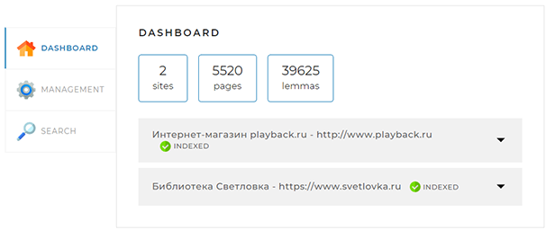
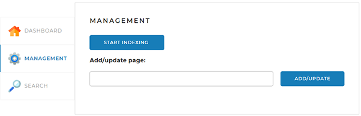
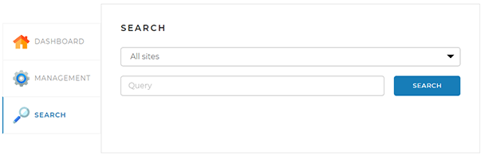

# Search Engine


## Описание проекта

Это проект поискового движка, позволяющего индексировать сайты и осуществлять по ним быстрый
поиск. Приложение в многопоточном режиме совершает обход всех страниц заданных сайтов и производит
их индексацию. Для индексации используются исходные формы встречающихся на странице слов, получаемые
с помощью библиотеки лемматизации. Данные страниц и полученные индексы хранятся в базе данных MySQL.
В дальнейшем, по поисковому запросу выдаются наиболее релевантные (соответствующие запросу)
страницы. Управление работой приложения осуществляется через веб-интерфейс. Проект выполнен учебных
целях.

## Технологии и библиотеки

* Java - версия 17
* Spring Boot - версия 2.6.7
* MySQL JDBC Driver - версия 8.0.30
* Liquibase - версия 4.17.2
* JSOUP - версия 1.15.3
* Lombok - версия 1.18.24
* Morphology for Apache Lucene - версия 1.5

## Настройки для запуска

### Подключение к БД

В проект добавлен драйвер для подключения к БД MySQL. Для запуска проекта, убедитесь, что у вас
запущен сервер MySQL 8.x. Создайте базу данных `search_engine` и поменяйте логин и пароль в файле
конфигурации `src/main/resources/application.yml` на актуальный (см. ниже).

### Настройки приложения

В конфигурационном файле `src/main/resources/application.yml` можно задать следующие параметры:

* Логин и пароль для доступа к БД:

```yaml
spring:
  datasource:
    username: root # имя пользователя
    password: password # пароль пользователя
```

* Имя и расположение changelog-файла Liquibase:

```yaml
  liquibase:
    change-log: db/master.xml # главный changelog-файл
```

* Перечень сайтов, которые необходимо проиндексировать. У каждого сайта должен быть указан адрес и
  имя, адреса всех сайтов должны быть полные и не должны содержать слеш в конце:

```yaml
available-sites-list:
  sites:
    - url: http://www.playback.ru        # адрес сайта №1
      name: Интернет-магазин playback.ru # имя сайта №1
    - url: https://www.svetlovka.ru      # адрес сайта №2
      name: Библиотека Светловка         # имя сайта №2
```

* Имя User-Agent и referrer которые необходимо подставлять при обходе страниц сайтов:

```yaml
search-bot-user-agent: Mozilla/5.0 (Windows NT 10.0; Win64; x64) AppleWebKit/537.36 (KHTML, like Gecko) Chrome/94.0.4606.81 Safari/537.36
referrer: http://www.google.com
```

* Путь к веб-интерфейсу:

```yaml
server:
  servlet:
    contextPath: /
```

## Веб-интерфейс

Представляет собой веб-страницу, открывающуюся по адресу, указанному в конфигурационном файле. Путь
к хосту можно задать через переменную `backendApiUrl` в
файле `/src/main/resources/templates/index.html` (по умолчанию http://localhost:8080/)

На этой веб-странице находятся три вкладки:

* ### Dashboard



Эта вкладка открывается по умолчанию. На ней отображается общая статистика по всем сайтам, а также
детальная статистика и статус по каждому из сайтов.

* ### Management



На этой вкладке находятся инструменты управления поисковым движком — запуск и остановка полной
индексации (переиндексации), а также возможность добавить (обновить) отдельную страницу по ссылке.

* ### Search



На ней находится поле поиска, выпадающий список с выбором сайта для поиска, а при нажатии на кнопку
«Найти» выводятся результаты поиска.